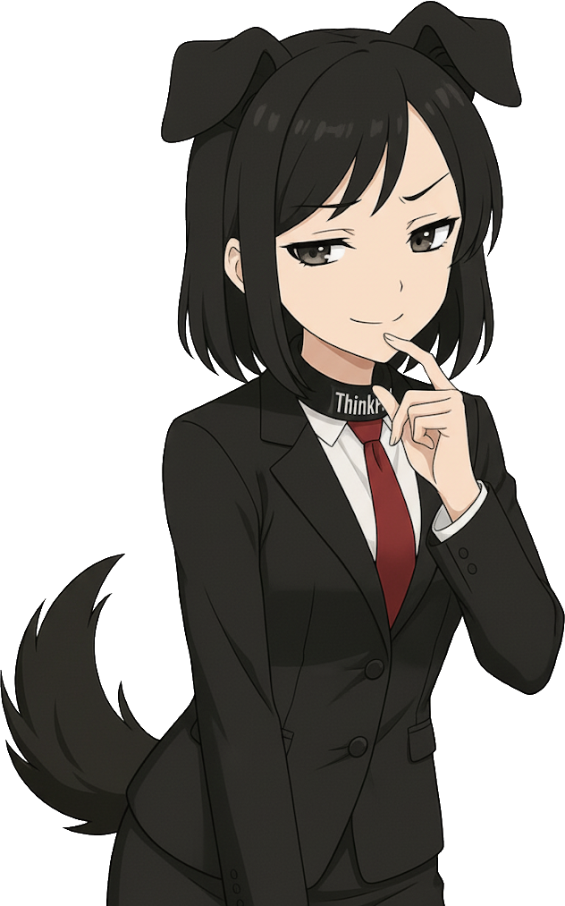

# Think-chan

Think-chan is a ThinkPad-themed [LivePNG](https://pypi.org/project/livepng/) model.
With dog ears and a tail. Because everyone knows a ThinkPad is your loyal companion until its last dying breath.

Because I am a talentless hack, she was created entirely using ChatGPT, Google Gemini, and some
manual postprocessing to clean up the worst of the LLM mistakes.

## Purpose and usage
Think-chan was primarily created to be [NyarchAssistant](https://github.com/NyarchLinux/NyarchAssistant) waifu,
but she can obviously be used for anything sprite-related.

To chat with your ThinkPad:

1. Install and launch NyarchAssistant
2. Download the [latest release](https://github.com/nyancient/think-chan/releases) of Think-chan
3. Untar Think-chan into `~/.var/app/moe.nyarchlinux.assistant/config/avatars/livepng/models/`
4. Restart NyarchAssistant, then go to `Settings -> Avatar -> Avatar model -> LivePNG`
    and set `LivePNG Model` to `think-chan`
5. Configure your preferred LLM and TTS engine for Nyarch Assistant. Avatar expressions are tied to TTS so even if
    you don't actually want to listen to your ThinkPad speaking you'll still need [a dummy TTS engine](dont-speak.py).

## Copyright
Since Think-chan is pure AI slop, generated using a combination of ChatGPT and Gemini, her copyright status is unclear.

She probably falls under one of the following categories:

1. Undistributable: it might be argued that Think-chan is derived work, based on the countless works stolen by OpenAI
    and Google to train their LLMs. If this turns out to be the case, _any_ distribution of Think-chan (including
    this repository) infringes on the copyright of pretty much every artist on the entire Internet.
2. Uncopyrightable: if she is not considered derived work, she almost certainly does not live up to the standards of
    creativity and originality required for copyright protection. These sprites were generated by automatic software
    processes from very generic prompts. Classifying them as a creative work would be an insult to
    the concept of art itself.
3. CC-BY-NC-SA 4.0: in the unlikely event that AI slop
    ends up considered both copyrightable _and_ not a derived work of the generating model's training data, Think-chan
    may be distributed under the terms of the
    [Creative Commons Attribution-NonCommercial-ShareAlike 4.0 license](https://creativecommons.org/licenses/by-nc-sa/4.0/).
